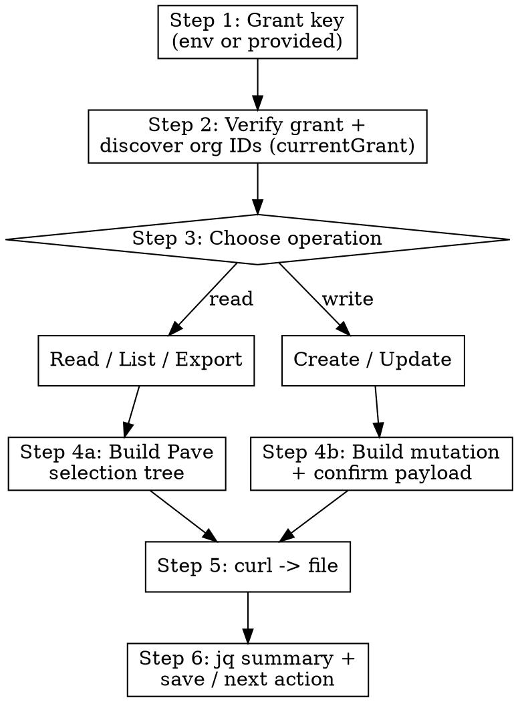

# JobTread Integration — Pave API

## Overview

Guided wizard for the JobTread **Pave API** — a GraphQL-like JSON query
language at a single endpoint. Collects the grant key and organization from
the user via `AskUserQuestion`, builds Pave queries interactively, then
executes them with `curl` via `Bash`. Never write Python — always use curl
for API calls and `jq` for inspecting output.

JobTread is construction-management software. Its data model centers on an
**organization** that owns **accounts** (customers and vendors), **jobs**,
**locations**, **documents** (estimates, budgets, bills, POs), **tasks**,
**daily logs**, and **cost items**.

## When to Use

- User wants to read/list/export JobTread jobs, customers, accounts,
  contacts, locations, documents, tasks, daily logs, or cost items
- User wants to create or update a job, customer, contact, or task
- User wants to sync JobTread data into another system (sheet, DB, report)
- User mentions JobTread, the Pave API/query language, or grant keys

## Two paths to JobTread data

There are **two** ways to reach JobTread in this environment. Pick based on
the task, and ask the user if unsure.

| Path | Use when | How |
| ---- | -------- | --- |
| **Pave API via curl** (this skill's default) | You need precise, custom queries, bulk export, exact field selection, or full control over reads/writes | `curl` to `https://api.jobtread.com/pave` with a grant key |
| **JobTread MCP tools** (if connected) | Quick, common actions with no query-building | `mcp__*__jobtread_query_api`, `jobtread_find_a_job`, `jobtread_create_job`, `jobtread_create_customer`, etc. |

If a JobTread MCP server is connected (tools named `*__jobtread_*`), prefer
it for one-off common actions (find a job, create a customer). Use the
**curl + Pave** path for anything custom, bulk, or precise. The rest of this
skill documents the Pave path.

## CRITICAL RULES

1. **One endpoint, one method.** Everything is `POST https://api.jobtread.com/pave`
   with `Content-Type: application/json`. There are no REST paths.
2. **Grant key goes in `query.$.grantKey`** — not in a header. See Auth below.
3. **Pave is a selection tree.** `{}` (empty object) requests a scalar field.
   A nested object requests a sub-object or connection. Only fields you list
   are returned.
4. **Always request `id`** on any object you may reference, update, or page
   through later.
5. **Arguments live in `$`.** Per-field args (`id`, `where`, `sortBy`,
   `page`, `size`) go inside that field's `$` object.
6. **Never read full Pave output into context.** Pipe to a file and inspect
   with `jq`. See Token Warnings.
7. **Never write Python.** curl for API calls, Bash/`jq` for everything else.
8. **Confirm before writes.** Any create/update/delete is an outward-facing
   change to live business data — show the user the exact payload and get a
   yes before executing.

## TOKEN WARNINGS

Job and document lists can be large, and documents carry deeply nested line
items. Always:

- **Pipe curl output to a file:** `| jq . > "$OUT/result.json"`
- **Show a small `jq` summary** after each call (see Step 5)
- **Never use the Read tool** on Pave output files
- **Use `jq`, `grep`, `head`** to query saved files and return only the answer
- **Bound every list** with `size` (e.g. 25–100) and paginate deliberately

## Setup: grant key + endpoint

```bash
PAVE_URL="https://api.jobtread.com/pave"
# Use $JOBTREAD_GRANT_KEY if set, otherwise the value the user provides.
if [ -z "$JOBTREAD_GRANT_KEY" ]; then
  echo "No JOBTREAD_GRANT_KEY in env — will use the key you provide."
fi
```

A grant key is created at **https://app.jobtread.com/grants** (Settings →
Integrations → Grants). It starts with `grant_`, is **shown only once**, and
**expires after 3 months of inactivity**. Treat it as a secret — never echo
it into committed files or PRs.

## Workflow



## Step 1: Collect the grant key

Use `AskUserQuestion`:

> "What is your JobTread grant key? (Type `env` if `JOBTREAD_GRANT_KEY` is
> already set. Create one at https://app.jobtread.com/grants — it starts with
> `grant_`.)"

- If `env`: reference `$JOBTREAD_GRANT_KEY` in commands and validate it's set.
- Otherwise: store the value and use it in the payloads below.

To keep the key out of shell history and command echoes, export it once and
reference the variable:

```bash
export JOBTREAD_GRANT_KEY='grant_...'   # only if the user pasted one
mkdir -p ./jobtread_out
OUT=./jobtread_out
```

## Step 2: Verify the grant and discover organization IDs

Every later query needs an **organization id**. `currentGrant` returns the
user and their org memberships in one call.

```bash
curl -s -X POST "$PAVE_URL" \
  -H "Content-Type: application/json" \
  -d "$(jq -n --arg gk "$JOBTREAD_GRANT_KEY" '{
    query: {
      "$": { grantKey: $gk },
      currentGrant: {
        id: {},
        user: { id: {}, name: {}, email: {} },
        memberships: {
          nodes: {
            id: {},
            organization: { id: {}, name: {} }
          }
        }
      }
    }
  }')" | jq . > "$OUT/grant.json"

# Summary (no secrets):
jq '{user: .currentGrant.user.name,
     orgs: [.currentGrant.memberships.nodes[].organization | {id, name}]}' "$OUT/grant.json"
```

Building the payload with `jq -n` (as above) keeps the grant key out of the
literal command string and handles JSON escaping. If the org list has more
than one entry, ask the user which organization to work in and store its id:

```bash
ORG_ID="22ABC..."   # chosen organization id
```

If the call returns an `errors` array or null `currentGrant`, the grant key is
invalid or expired — send the user back to https://app.jobtread.com/grants.

## Step 3: Choose the operation

Use `AskUserQuestion`:

> "What do you want to do in JobTread?"
> - **Read / list / export** — pull jobs, customers, documents, etc.
> - **Create** — add a job, customer, contact, or task
> - **Update** — change a field on an existing record

## Step 4a: Build a read query (Pave selection tree)

The query is a JSON tree. Start from `organization` (scoped by `ORG_ID`) and
drill into a **connection** (`jobs`, `accounts`, `documents`, `tasks`, …).
Connections accept `$` arguments and return `nodes`, `count`, and `nextPage`.

Common connection arguments (all optional, inside `$`):

| Arg | Purpose | Example |
| --- | ------- | ------- |
| `size` | page size (cap your output) | `"size": 25` |
| `page` | pagination cursor from a prior `nextPage` | `"page": "<cursor>"` |
| `sortBy` | list of `{field, order}` | `[{"field":"createdAt","order":"desc"}]` |
| `where` | filter expression (see PAVE_QUERIES.md) | `[["closedOn","=",null]]` |
| `search` | free-text search | `"search": "kitchen"` |

### Example: list the 25 most recent jobs

```bash
curl -s -X POST "$PAVE_URL" \
  -H "Content-Type: application/json" \
  -d "$(jq -n --arg gk "$JOBTREAD_GRANT_KEY" --arg org "$ORG_ID" '{
    query: {
      "$": { grantKey: $gk },
      organization: {
        "$": { id: $org },
        id: {}, name: {},
        jobs: {
          "$": { size: 25, sortBy: [{ field: "createdAt", order: "desc" }] },
          count: {},
          nextPage: {},
          nodes: {
            id: {}, name: {}, number: {}, createdAt: {},
            location: { id: {}, name: {}, address: {} }
          }
        }
      }
    }
  }')" | jq . > "$OUT/jobs.json"

# Summary:
jq '{count: .organization.jobs.count,
     nextPage: .organization.jobs.nextPage,
     jobs: [.organization.jobs.nodes[] | {id, number, name}]}' "$OUT/jobs.json"
```

To page forward, copy `nextPage` into the next call's `$.page`. Loop until
`nextPage` is null. For bulk export, append each page's `nodes` to a file:

```bash
jq '.organization.jobs.nodes' "$OUT/jobs.json" >> "$OUT/all_jobs.ndjson"
```

For more selection-tree templates (customers, contacts, documents with line
items, tasks, daily logs, cost items, custom fields, filtering and sorting),
see **PAVE_QUERIES.md** in this skill directory.

### Building a query interactively

If the user isn't sure what to request, ask which **object** (jobs,
customers, documents, tasks…) and which **fields** they care about, then
assemble the selection tree. Default to a small field set plus `id`, and
always cap with `size`.

## Step 4b: Build a create / update mutation

Mutations are top-level fields next to the data you select back. The
operation name carries its inputs in `$`, and you select the resulting
object's fields to confirm the write.

> **Verify argument names before running.** Exact input/return field names
> per object type are authoritative in the interactive explorer at
> **https://app.jobtread.com/docs**. If a mutation errors on an unknown
> argument, open the docs (or use the JobTread MCP `jobtread_create_*` tools,
> which encode the correct fields) and adjust. Always show the user the full
> payload and get explicit confirmation before executing a write.

### Example: create a job

```bash
curl -s -X POST "$PAVE_URL" \
  -H "Content-Type: application/json" \
  -d "$(jq -n --arg gk "$JOBTREAD_GRANT_KEY" --arg org "$ORG_ID" \
        --arg name "123 Main St Remodel" --arg loc "$LOCATION_ID" '{
    query: {
      "$": { grantKey: $gk },
      createJob: {
        "$": { organizationId: $org, name: $name, locationId: $loc },
        createdJob: { id: {}, name: {}, number: {} }
      }
    }
  }')" | jq . > "$OUT/create_job.json"

jq '.createJob.createdJob // .errors' "$OUT/create_job.json"
```

### Example: update a job's name

```bash
curl -s -X POST "$PAVE_URL" \
  -H "Content-Type: application/json" \
  -d "$(jq -n --arg gk "$JOBTREAD_GRANT_KEY" --arg id "$JOB_ID" \
        --arg name "New Job Name" '{
    query: {
      "$": { grantKey: $gk },
      updateJob: {
        "$": { id: $id, name: $name },
        job: { id: {}, name: {} }
      }
    }
  }')" | jq . > "$OUT/update_job.json"

jq '.updateJob // .errors' "$OUT/update_job.json"
```

**Suppress notifications** during bulk writes by adding `notify: false` to the
top-level `$` (alongside `grantKey`). You can also set `timeZone` or
`viaUserId` there.

## Step 5: Execute

Run the assembled `curl` and **always** pipe through `jq .` into a file under
`$OUT`. Do not paste raw responses into context.

## Step 6: Present results & check for errors

After every call:

1. Check for errors first: `jq '.errors // empty' "$OUT/result.json"`.
   A non-empty `errors` array means the query failed — show the message.
2. Show a compact `jq` summary (counts + key fields), never the full dump.
3. Tell the user where the file was saved.
4. For lists: report `count` and whether `nextPage` is set (more pages).
5. Ask the next action (page more, change fields, run a write, export).

## Pave query language — quick reference

| Concept | Syntax | Notes |
| ------- | ------ | ----- |
| Request a scalar field | `"name": {}` | empty object = "give me this value" |
| Request a sub-object | `"location": { "id": {}, "name": {} }` | nest the fields you want |
| Connection (list) | `"jobs": { "nodes": { ... }, "nextPage": {}, "count": {} }` | paginated collection |
| Arguments | `"$": { "id": "...", "size": 25 }` | per-field, always the `$` key |
| Auth + global opts | top-level `"$": { "grantKey": "...", "notify": false }` | grantKey required |
| Filter | `"$": { "where": [["closedOn","=",null]] }` | see PAVE_QUERIES.md |
| Sort | `"$": { "sortBy": [{"field":"createdAt","order":"desc"}] }` | list of rules |
| Mutation | top-level `"createJob": { "$": {…}, "createdJob": {…} }` | select result back |

## Common object types

| Object | Reached via | Key fields |
| ------ | ----------- | ---------- |
| Organization | `currentGrant.memberships.nodes[].organization`, or `organization` w/ `$.id` | `id`, `name` |
| Job | `organization.jobs` | `id`, `name`, `number`, `createdAt`, `location`, `account` |
| Account (customer/vendor) | `organization.accounts` | `id`, `name`, `type`, `contacts` |
| Contact | `account.contacts` | `id`, `name`, `email`, `phone` |
| Location | `organization.locations`, `job.location` | `id`, `name`, `address` |
| Document (estimate/budget/bill/PO) | `job.documents`, `organization.documents` | `id`, `type`, `status`, `lineItems` |
| Task | `organization.tasks`, `job.tasks` | `id`, `name`, `startDate`, `endDate`, `progress` |
| Daily log | `job.dailyLogs` | `id`, `date`, `notes` |
| Cost item | `organization.costItems`, document `lineItems` | `id`, `name`, `unitCost` |
| Custom fields | `customFieldValues` on most objects | `customField { name }`, `value` |

## Common mistakes

| Mistake | Fix |
| ------- | --- |
| Grant key in a header | It goes in `query.$.grantKey` |
| Using REST paths like `/jobs` | Only `POST /pave` exists |
| Leaf field written as `"name": true` | Use `"name": {}` (empty object) |
| Forgetting `id` | Always request `id` on referenceable objects |
| Unbounded list | Always set `size`; paginate with `nextPage` → `$.page` |
| Reading output with the Read tool | Use `jq` summaries; pipe to a file |
| Guessing mutation arg names | Verify in https://app.jobtread.com/docs explorer |
| Writing without confirmation | Show payload, get a yes — it's live data |

## Error handling

| Symptom | Likely cause | Action |
| ------- | ------------ | ------ |
| `currentGrant` null / `errors` on auth | bad or expired grant key | Re-create at https://app.jobtread.com/grants |
| `errors` naming a field | unknown field/arg in selection | Fix the field; check the docs explorer |
| Empty `nodes` | filter too narrow or wrong org | Re-check `ORG_ID` and `where` |
| HTTP 429 | rate limited | Wait and retry; reduce `size` / parallelism |
| Truncated/huge response | unbounded list or deep nesting | Add `size`, request fewer fields |

## Sources

- JobTread API docs (interactive explorer): https://app.jobtread.com/docs
- Grant key management: https://app.jobtread.com/grants
- JobTread Open API overview: https://www.jobtread.com/integrations/open-api
